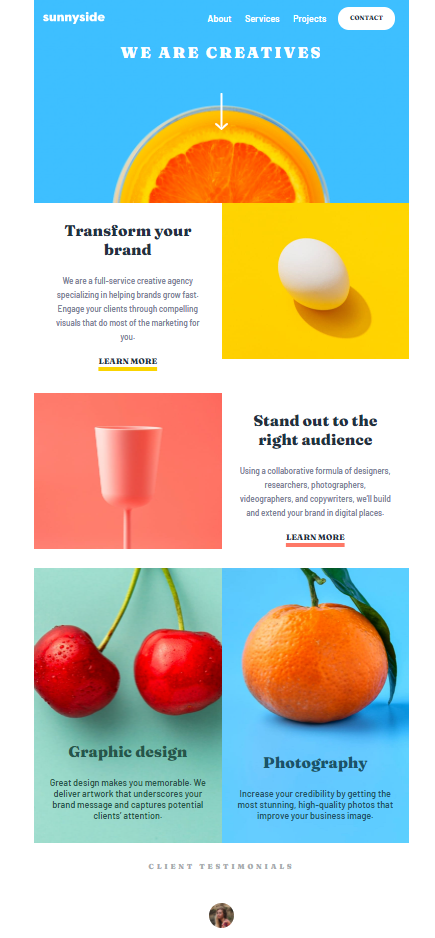

# Frontend Mentor - Sunnyside agency landing page solution

This is a solution to the [Sunnyside agency landing page challenge on Frontend Mentor](https://www.frontendmentor.io/challenges/sunnyside-agency-landing-page-7yVs3B6ef). Frontend Mentor challenges help you improve your coding skills by building realistic projects.

## Table of contents

- [Overview](#overview)
  - [The challenge](#the-challenge)
  - [Screenshot](#screenshot)
  - [Links](#links)
- [My process](#my-process)
  - [Built with](#built-with)
  - [What I learned](#what-i-learned)
  - [Continued development](#continued-development)
- [Author](#author)

## Overview

### The challenge

Users should be able to:

- View the optimal layout for the site depending on their device's screen size
- See hover states for all interactive elements on the page

### Screenshot

### Links

- Solution URL: [GitHub](https://github.com/iulian-cenusa/frontend-mentor-sunnyside-agency-landing-page)
- Live Site URL: [GitHub Pages](https://iulian-cenusa.github.io/frontend-mentor-sunnyside-agency-landing-page/)

## My process

### Built with

- Semantic HTML5 markup
- CSS custom properties
- Flexbox
- Mobile-first workflow

### What I learned

This project helped me gain experience with web design and CSS Flexbox and positioning.

### Continued development

Even if this project looks completed, there will still be always something to improve on it.

## Author

- Frontend Mentor - [@iulian-cenusa](https://www.frontendmentor.io/profile/iulian-cenusa)
- GitHub - [GitHub Profile](https://github.com/iulian-cenusa)
- Bitbucket - [Bitbucket Profile](https://bitbucket.org/iulian_cenusa/)
- CodePen - [CodePen Profile](https://codepen.io/iulian-cenusa/)
- Twitter - [@IulianCenusa](https://twitter.com/IulianCenusa)
